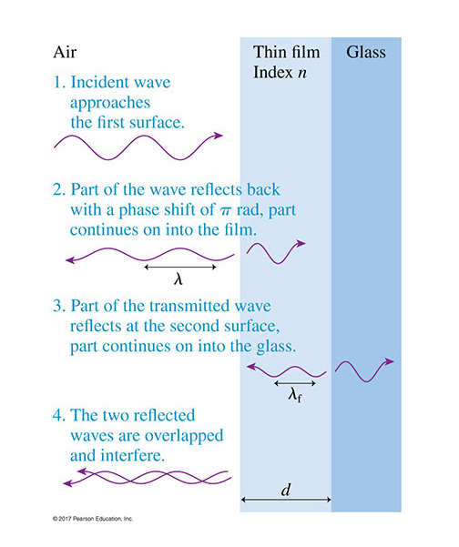
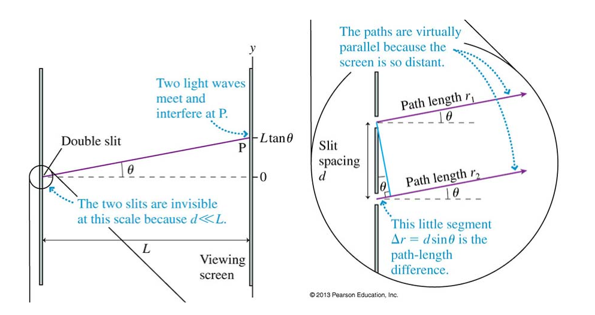
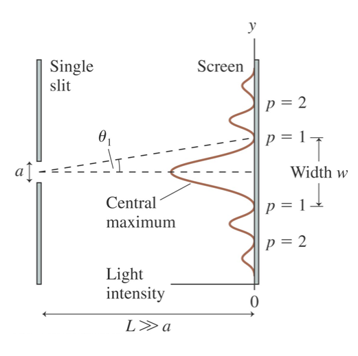
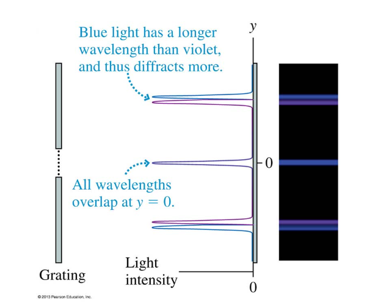

## Circular Motion:

Using polar coordinates is simpler for circular motion, so the following are some important kinematic definitions in polar coordinates and periodic motion.

**Angular Displacement**   $\bar\theta = \bar\theta_f - \bar\theta_i$, measured in $rad$.

**Angular Velocity**   $\bar\omega = \frac{d\bar\theta}{dt}$, measured in $rad/s$.

**Angular Acceleration**   $\bar\alpha = \frac{d\bar\omega}{dt}$, measured in $rad/s^2$.

**Frequency**  $f = \frac{no. \: of \: turns}{\Delta t}$

**Periodic time** $T = \frac{2\pi}{\omega}= \frac{1}f$

## Simple Harmonic Motion:

For a body attached to a spring which exerts a force $F = -kx$ the equation of motion is:
$$m \ddot{x} = -kx$$
Once this differential equation is solved, the result will be able to describe the motion of the system.
$$x = A \cos(\omega t + \phi)$$
Where $A$ is the amplitude, $\omega = \sqrt{\frac{k}m}$ is the natural frequency and $\phi$ is the phase at $t = 0$.
## Damped Oscillations:

If a spring system oscillates in a viscous fluid it will be affected by a damping force $F_d = -bv$, and then its  equation of motion is going to be as follows.
$$m \ddot{x} = -kx - b \dot{x}$$
There are three solutions to this deferential equation, we will only focus on two.
### Under Damping
Where the damping isn't enough to prevent oscillation.
$$x = A_0 e^{-\gamma t}\cos(\omega_d t + \phi)$$
Where $\gamma = \frac{b}{2m}$ and $\omega_d = \sqrt{\omega_0^2 - \gamma^2}$ is the damped frequency.

```python {pre}

import matplotlib.pyplot as p
import math as m

W, graph = p.subplots()
```

```python
r = 800
sc = 0.1

X = [sc * x for x  in range(r)]
Y = [ m.e**(-0.07*x * sc) * m.cos(x * sc) for x in range(r)]

E1 = [m.e**(-0.07*x * sc) for x in range(r)]
E2 = [-m.e**(-0.07*x * sc) for x in range(r)]

graph.plot(X, Y, "b")
graph.plot(X, E1, "r", alpha = 0.5)
graph.plot(X, E2, "r", alpha = 0.5)

p.show()
```

We can see that since the amplitude is decreasing exponentially the wave function is enveloped by the amplitude function $A = A_0 e^{-\gamma t}$.

To describe the decrease in the amplitude of oscillation we will construct the **Logarithmic Decrement**. 
$$\delta = \ln(\frac{A_n}{A_{n+1}}) = \gamma T_d$$
### Critical Damping

In this case the damping is just enough to prevent oscillation, so the body will return to the rest position as fast as possible without overshooting.
$$x = (d_1 + d_2 t)e^{-\gamma t}$$
by differentiating we get:
$$v = d_2 e^{- \gamma t} - (d_1 + d_2 t) \cdot \gamma e^{-\gamma t}$$
## Forced Oscillations:

A spring system that is affected by an external force $F = F_0 \cos(\Omega t)$ and a damping force $F_D = -rv$ will be described by the following equation of motion.
$$m \ddot{x}+ k_s x + b \dot{x} = F_0 \cos( \Omega t)$$
Solving this differential equation we get $x = A \cos(\Omega t - \phi)$, where $A(\Omega) = \frac{F_0}{m\sqrt{(\omega_0^2 - \Omega^2)^2 + (2\gamma \Omega)^2}}$ and $\phi = \tan^{-1}( \frac{2\gamma \Omega}{\omega_0^2 - \Omega^2})$.

Graphing $A(\Omega)$ we get the following curve which a maximum value for the amplitude depending on the driving frequency.
```python
r = 125

X = [x/10 for x  in range(r)]
Y = [ 10/m.sqrt( (25-(x/10)**2)**2 + (2* 0.7 *x/10)**2) for x in range(r)]

graph.plot(X, Y, "b")
p.show()
```
The frequency of applied force that will result in the greatest amplitude is $\Omega_A = \sqrt{\omega_0^2 -2\gamma^2}$ and that maximum amplitude is $A = \frac{F_0}{r \sqrt{\omega_0^2 -\gamma^2}}$, if we want the spring to oscillate at maximum velocity however, then $\Omega = \omega_0$, $A = \frac{F_0}{r\omega_0}$, and $v_{max} = \frac{F_0}b$.
## Waves:
Waves transfer energy from one place to another without the transmission of particles, they can be classified based on three criteria, firstly:
**Mechanical Waves:** need a medium to propagate.
**Electromagnetic Waves:** don't need a medium.

Secondly:
**Transverse:** the vibration is perpendicular to wave propagation.
**Longitudinal:** the vibration is parallel to wave propagation.

And lastly, **Traveling and Standing Waves**.

  

### Wave equation

The function of a wave moving in a line is $y = f(kx-\omega t)$, from this we can find the differential equation for wave motion.
$$\frac{\partial^2 y}{\partial x^2} = \frac{1}{v^2} \frac{\partial^2 y}{\partial t^2}$$
A case of such wave equation is $y(x,t) = \frac{A}{(x - vt)^2 + 1}$, which describes a pulse moving through a medium such as a rope for example.
```python
r = 100

X = [x/10 for x  in range(-r, r)]
Y0 = [1/((x/10)**2 +1) for x in range(-r, r)]
Y1 = [1/((x/10 - 1.5)**2 +1) for x in range(-r, r)]
Y2 = [1/((x/10 - 3)**2 +1) for x in range(-r, r)]

graph.plot(X, Y0, "b", alpha = 0.33)
graph.plot(X, Y1, "b", alpha = 0.66)
graph.plot(X, Y2, "b")
   
p.show()
```
We can see from the equation that as time passes (as $t$ increases) the curve will shift to the right, simulating the propagation of the wave. The velocity of a wave is determined by its medium so in the case of a rope the velocity $v = \sqrt{ \frac{T}{\mu} }$, where $T$ is the tension in the wire and $\mu$ is the mass per unit length.

However, we're mainly concerned with sinusoidal waves which behave according to this equation.
$$y(x,t) = A \cos(kx-\omega t) = A \cos(k(x-vt))$$
Where $\omega = \frac{2\pi}T$ and $k = \frac{2\pi}\lambda$.
```python
r = 1300

X = [x/100 for x  in range(-r, r)]
Y0 = [m.sin(x/100) for x in range(-r, r)]
Y1 = [m.sin(x/100 - 1) for x in range(-r, r)]
Y2 = [m.sin(x/100 -2) for x in range(-r, r)]

graph.plot(X, Y0, "b", alpha = 0.33)
graph.plot(X, Y1, "b", alpha = 0.66)
graph.plot(X, Y2, "b")

p.show()
```
Similarly to the pulse, as $t$ increases the wave propagates to the right.
### Energy and Power

A continuous wave can be considered an infinite number of particles in simple harmonic motion, the energy of each particle $E = \frac{1}2 k A^2$, where $k = m \omega^2 = m (2\pi f)^2 = 4 \pi^2 m f^2$.

Replacing $m = \rho V = \rho S l$, where $S$ is the cross-sectional area, and $l = vt$.
$$E = 2 \pi^2 \rho S v t f^2 A^2$$
$$P = 2 \pi^2 \rho S v f^2 A^2$$
## Sound Waves:
### Sound Wave Intensity
Given a source of spherical waves operating at a power output $P$.

**Intensity:** $I = \frac{P}A = \frac{P}{4 \pi r^2}$

Since sound waves are mechanical, longitudinal, and *spherical* waves; this equation applies to them; however, the human perception of sound is logarithmic.

**Sound Intensity:** $\beta = 10 \log(\frac{I}{I_0})$, where $I_0 = 10^{-12}$ and $\beta$ is measured in decibel $(dB)$.
### Beats
When two waves with slightly different frequencies interfere, the difference between their phases continuously changes making them shift back and forth between constructive and destructive interference, so they produce a wave with periodically variable amplitude called a *Beat*.

Mathematically this can be represented by adding the two waves $D_1 (x,t) = A \cos(\omega_1 t - kx)$ and $D_2 (x,t) = A \cos(\omega_2 t - kx)$, resulting in the following equation for beats:
$$D (x,t) = 2A \cos(\frac{|\omega_1 - \omega_2|}2 t - kx) \cos(\frac{|\omega_1 + \omega_2|}2 t - kx)$$

```python
r = 600

X = [x/100 for x  in range(-r, r)]
Y = [2 * m.cos(1*x/100) * m.cos(20.5*x/100) for x in range(-r, r)]

E1 = [2 * m.cos(1*x/100) for x in range(-r, r)]
E2 = [-2 * m.cos(1*x/100) for x in range(-r, r)]

graph.plot(X, Y, "b")
#graph.plot(X, E1, "r", alpha = 0.65)
#graph.plot(X, E2, "r", alpha = 0.65)
p.show()
```
The frequency of the new sound is $\frac{f_1 + f_2}2$, but the frequency of the beat is $|f_1 - f_2|$.
### The Doppler Effect
If either the source of sound or the receiver is moving towards or away from the other then the perceived frequency is different. In the case of a moving receiver, it's because the relative velocity between him and the wave is changed, In the case of a moving source, it's because the motion changes the produced wave frequency.
$$f' = f_0 \cdot  \frac{v_0 \pm  v_r}{v_0 \mp v_s}$$
Where $v_0$ is the wave speed (sound speed is around $343 \; m/s$).

**Note:** $v_r$ is +ve when the receiver is approaching while $v_s$ is -ve when the source is approaching and vise versa.
## Interference:
*Coherence* is a measure of how constant the phase difference between to waves is, The addition of two coherent waves of phase differences $\Delta \phi$ is called *interference*, it can be constructive if $\Delta \phi = m \cdot 2\pi$, or destructive if $\Delta \phi = (2m + 1)\pi$.

For two coherent waves which have taken different paths $\Delta \phi = k \Delta r$ is the phase difference between the two waves.
## Standing Waves:
If a pulse travels from a light segment of the rope to a denser one the reflected pulse experiences a $\pi \; rad$ change in its phase which happens to prevent the rope from snapping apart. So when sending a sinusoidal wave through a rope with two fixed ends, two opposing waves $y_1$ and $y_2$ will be generated with a phase difference $\Delta \phi = \pi$, the interference of the two waves forms a standing wave which can be described as follows.
$$y_1 + y_2 = A \cos(kx-\omega t) + A \cos(kx + \omega t + \pi)$$
$$= -2A \sin(kx) \sin(\omega t)$$
A standing wave doesn't propagate, it only oscillates in place, and it assigns the amplitude of oscillation at any point on the rope by the function $2A \sin(kx)$, defining *nodes* as the points with no oscillation, and *anti-nodes* as the points with maximum oscillation.
$$2A\sin(kx) = 0 \rightarrow  kx = \frac{2\pi}\lambda x = m\pi$$
$\therefore x = m\frac{\lambda}2$ is the $(m+1)th$ node, where m starts from zero.
$$2A\sin(kx) = 2A \rightarrow  kx = \frac{2\pi}\lambda x = (m + \frac{1}2)\pi$$
$\therefore x = (m + \frac{1}2) \frac{\lambda}2$ is the $(m+1)th$ anti-node.
### Harmonics
A standing wave between two fixed ends must have a node at both ends, the first end of the rope is at $x = 0$ where the first node is, the *harmonic* of the standing wave depends on the position of the second end of the rope.
  
**The Fundamental Harmonic** occurs when the second end of the rope is at the second node and $\lambda = 2L$, where $L$ is the length of the rope, since $v = \sqrt{\frac{T}{\mu}}$ the fundamental frequency $f = \frac{v}{\lambda} = \frac{1}{2L} \sqrt{\frac{T}{\mu}}$, in which case there is only one loop, two nodes, and one anti-node.

**The $\textbf{nth}$ Harmonic** occurs when the second end of the rope is at the $(n+1)th$ node and $\lambda = \frac{2}n L$, since $v = \sqrt{\frac{T}{\mu}}$ the frequency $f = \frac{v}{\lambda} = \frac{n}{2L} \sqrt{\frac{T}{\mu}}$, in which case there are $n$ loops, $(n+1)$ nodes, and $n$ anti-nodes.
## Diffraction & Interference Experiments:
### Thin Film
A light ray traveling through a medium of refractive index $n_1$ falls perpendicularly on a thin film of thickness $t$ and refractive index $n_2$ which's placed between two mediums of refractive indexes $n_1$ & $n_3$, the ray reflected off the thin film and the ray reflected off medium $3$ will interfere such that $\Delta \phi = k \cdot 2t = \frac{2\pi}\lambda \cdot 2t$.

If $n_2 > n_1$ XOR $n_3 > n_2$, The two rays will also have an additional phase difference of $\pi$, so $\Delta \phi = k \cdot 2t + \pi= \frac{2\pi}\lambda \cdot 2t +\pi$.

For example, if $n_3 > n_2 > n_1$ in the case of coating then the phase difference $\Delta \phi = \frac{2\pi}\lambda \cdot 2t = (2m + 1)\pi$ in the case of destructive interference.

$t = (2m + 1) \cdot \frac{\lambda}4$, for minimum thickness $m = 0$.

However, if $n_2 > n_1, n_3$ then to achieve destructive interference, we find the thickness of the film such that $\Delta \phi = \frac{2\pi}\lambda \cdot 2t +\pi = (2m + 1)\pi$.

$t = m \cdot \frac{\lambda}2$, for minimum thickness $m = 1$.
### Optical Wedge
Similarly to the thin film, light rays coming from a medium of refractive index $n_1$ fall perpendicularly on an optical wedge of angle $\theta$ and refractive index $n_2$ surrounded by two mediums of refractive indexes $n_1$ & $n_3$, the two reflected waves will interfere following the same rule as the thin film $\Delta \phi = k \cdot 2t = \frac{2\pi}\lambda \cdot 2t$, forming an interference pattern which depends on the thickness of the wedge at any given point.

Usually $n_2 < n_1, n_3$, to find the horizontal position of the dark fringes set $\Delta \phi = \frac{2\pi}\lambda \cdot 2t +\pi = (2m + 1)\pi$ then substitute $x = t\cot(\theta)$.
$$x_{dark} = \frac{m \lambda_{wedge}}2 \cot(\theta) = \frac{m \lambda_0}{2 n_{wedge}} \cot(\theta)
$$
### Double Slit Diffraction
When light from a monochromatic source goes through two *very small* slits separated by a distance $d$, the two produced waves fall on the screen at a distance $L>>d$ forming the very famous interference pattern.

The phase difference between the two waves $\delta = \frac{2\pi}\lambda d\sin(\theta)$, for bright fringes $\delta = m \cdot 2\pi$, bright fringes start at $m = 1$, excluding the central fringe.
$$d \sin(\theta) = m \lambda$$
For dark fringes $\delta = (2m + 1)\pi$, the first dark fringe starts at $m = 0$.
$$d \sin(\theta) = (2m + 1) \frac{\lambda}2$$
**Note:** for small angles we can approximate $\sin(\theta) \approx \theta_{rad} \approx \tan(\theta) = \frac{y}L$

Using a phasor to find the amplitude of the resultant we can apply the cosine rule:
$$A_r = \sqrt{2A^2 + 2A^2 \cos(\delta)} = 2A \cos(\frac{\delta}2)$$
Since the **intensity** $I \propto A^2$.
$$I = I_0 \cos^2(\frac{\delta}2)$$
### Single Slit Diffraction
#### Huygens' Principle
Instead of modelling light as a stream of particles, Huygens' Principle states that every wavefront contains an infinite number of spherical wavelet sources, which in turn interfere with each other to form the following wavefront.

When light goes through a slit of width $a \approx \lambda$ to fall on a screen at a distance $L >> a$, an interference pattern with narrow dark fringes is observed.

Using Huygens' principle, we find that all the wavelet sources interfere to produce the pattern, the distance between each two consecutive sources being $\Delta y = \frac{a}n$, and the phase difference $\delta = \frac{2\pi}{\lambda} \Delta y \sin(\theta) =  \frac{2\pi a}{\lambda n} \sin(\theta)$, the resultant of all the wavelets would be:
$$x_R = x_1 + x_2 + x_3 + ...$$
$$= A \cos(\omega t + \delta) + A \cos(\omega t + 2 \delta) + A \cos(\omega t + 3 \delta) + ...$$

The amplitude of the resultant $A_R = A \frac{\sin(n\delta/2)}{\sin(\delta/2)} \approx A \frac{\sin(n\delta/2)}{\delta/2}$, this can rewritten in terms of the phase difference between the first and last wavelets $\beta = n\delta = \frac{2\pi a}{\lambda} \sin(\theta)$.
$$A_R = nA \frac{\sin(\beta/2)}{\beta/2} = A_0 \frac{\sin(\beta/2)}{\beta/2}$$
Since the **intensity** $I \propto A^2$.
$$I = I_0 \frac{\sin^2(\beta/2)}{(\beta/2)^2}$$
To find the $mth$ dark fringe $I = 0, \; \therefore \frac{\beta}2 = \frac{\pi a}{\lambda} \sin(\theta) = m \pi$
$$a\sin(\theta) = m \lambda$$
Where $m \in \{1,2,3, ...\}$.
### Diffraction Grating

When light goes through multiple *very small* slits, each two consecutive slits separated by a distance $d =  \frac{length}{no. of slits}$, and falls on a screen at a distance $L$, an interference pattern with narrow bright fringes is formed, to find the $mth$ bright fringe after the central fringe set the phase difference $\delta = \frac{2\pi}\lambda d\sin(\theta) = m \cdot 2\pi$.
$$d\sin(\theta) = m\lambda$$


Since the angle of the fringe $\theta$ depends on the wavelength $\lambda$, every color is spaced differently which means that the full spectrum can be observed at each value of $m$ when a white light source is used, except at $m = 0$ where $\theta = 0$ for all values of $\lambda$ so all colors fall at the center of the screen and a white fringe is observed.